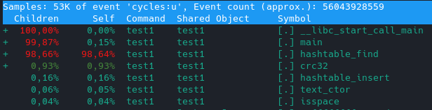
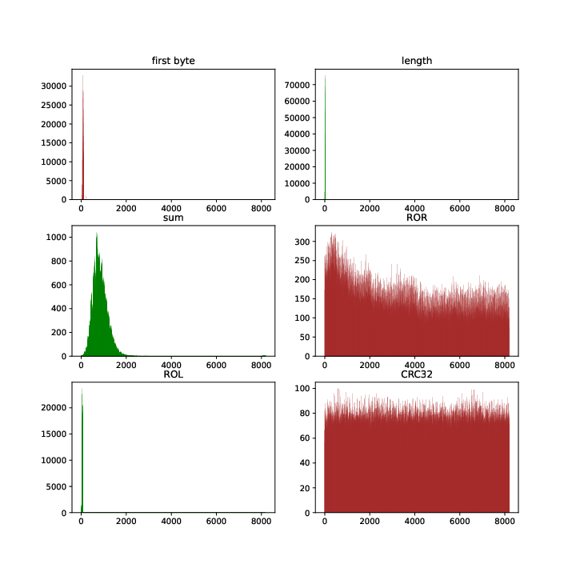

# Hashtable

This repository contains hashtable implementation and performance tests

# Hashtable optimization 

## Limitations

Hashtable has limited key size, which equals 32 bytes. It provides ability to use intrinsics as a way of optimization.

## Experiment layout

Hashtable is filled with words from Ray Bradbury book "Fahrenheit 451" (~13,000 unique words).
After it hashtable is searched for words for 100,000,000 times.
Size of hashtable is 256 hashes.

Amount of iterations is taken with respect of time spent on inserting elements.

`perf` is used for profiling.

All programs compiled with `gcc` with `-O2` option.

---
## Unoptimized version

Unoptimized version doesn't contain any specific optimizations. Also it uses 64-bit hash.

Total elapsed time -- 38.5 s. As we can see branch misses are very low, that is expected for hashtable, because it's a data structure.

Report says that `memcmp()` takes 76.4% time of program execution. It it the hottest part, so we'll take care about it in the first place.

Second hottest function is `hashtable_find()`, which is expected. However, `memcmp()` for some reason wasn't counted as a child of `hashtable_find()`. Probably the reason is discrete sampling.

Third hottest function with 7.7% is `list_next()`, so it's worth considering for optimization.

The most loaded part of `hashtable_find()` is `memcmp()` call, as expected.

---
## New hash function and `memcmp()` optimization

First optimization introduces `memcmp()` optimization using 32-byte length limitation and new hash function.

We'll use size limitation to reduce execution time.
We replace `len` argument with compile-time constant `KEY_SIZE` and require key to be in buffer of `KEY_SIZE`.
That way compiler generates simple ariphmetic operations instead of `memcmp()` call. Also it removed `strlen()` call in the beginning.

`memcmp()` converted to 2 `mov` and 2 `xor`, so it takes lower percent of function execution.

Another edge is hash function. 64-bit hash is overkill for hashtable, so **CRC32** hash was taken.

From `perf stat` we see 20.3 s. Execution time dropped by 47%. We reduced amount of instructions and increased instruction-per-cycle ratio.

As we can see from report, `hashtable_find()`, `CRC32()` and `list_next()` are hottest functions.

---
## AVX optimization

This part introduces avx optimization in `hashtable_find()` and `CRC32()` and inlining of `list_next()`.

We used intrinsics to compare 32-byte key as a whole, replacing `memcmp()`.

`CRC32()` was rewritten using processor intrinsics for **CRC32** hash.

After this replacements almost all function execution is hanged on `vcmpeqb` and `vpmovmskb`. Good result.

**CRC32** algorithm takes 0.93% of execution. However, we may use additional optimization because our experimental layout provides ~50 collisions.

Execution time reduced by 37%.

## Inline assembly

This part describes attempt of *inline assembly* optimization.

It's expected that intrinsics will show equal (if not better) performance comparing with inline assembly. Let's check it.

AVX:

Inline:

For better results `perf` was used with `-r 10` argument for evaluating average on 10 times. As we can see intrinsics have a little edge to inline assembly due to compiler optimizations. Code readability and portability is much higher when using intrinsics, so inline assembly is worse in both aspects.

---
## CRC32 optimization

This part describes attempt of `CRC32` optimization.

Intrinsic implementation of CRC32 is equal to assembler implementation. To compare, assembler implementation without loop and intrinsic implementation with loop are given.

CRC32 on intrinsics:

CRC32 on assembler:

CRC32 on intrinsics:

CRC32 on assembler:

CRC32 on intrinsics:

CRC32 on assembler:

Assembler file is not as flexible as .cpp file, therefore main implementation will take intrinsic implementation.

## Results

In this conditions all optimizations provided **3x** speed-up. Code Conversion Efficiency = 3/20 * 1000 = 150.

# Hash research

## Experiment layout

Collection of english dictionaries is taken as input for hashtable inserting (570,000 unique words).

7 hashes are researched:

1) **'return one'**    - returns `1` on every input
2) **'first byte`** - returns first byte
3) **'length'**        - returns object length
4) **'sum'**           - returns sum of byte elements
5) **'ROR'**           - h_0 = data[0], h_i = ror(h) xor(data[i])
6) **'ROL'**           - h_0 = data[0], h_i = rol(h) xor(data[i])
7) **CRC32**

Obiviously, 'return one' gives worst result and it's plot would be trivial.
From the picture we can see that 'first byte', 'length' and 'ROL' are useless as hashes.
'ROR' and 'crc32' show good distribution, therefore they can be used as hashes.
'sum' hash seems to be good on low sizes of hashtable, but after ~1000 it's distribution becomes bad.